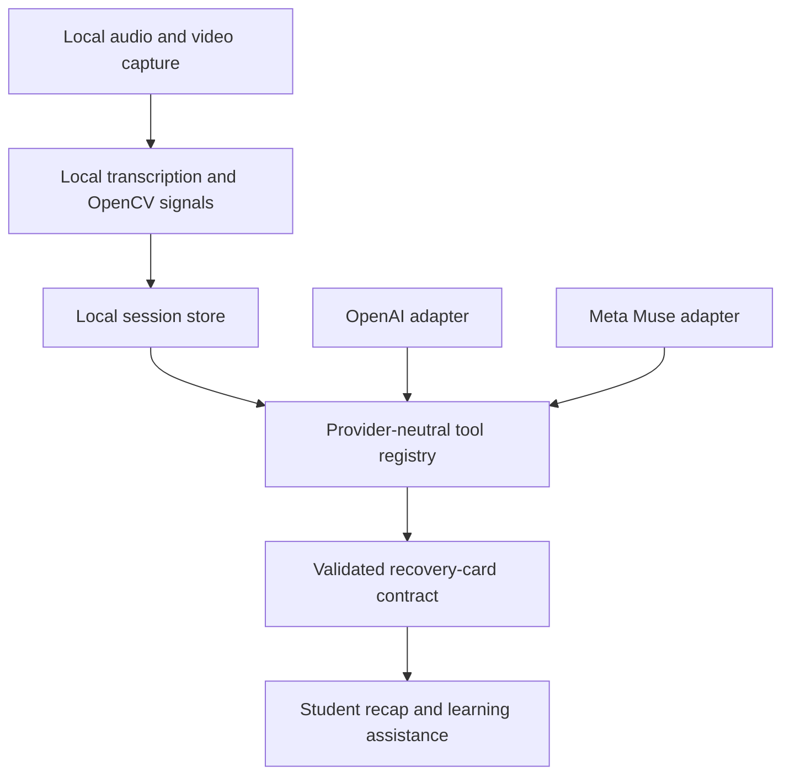

# AI Provider and Tool-Calling Implementation Plan

## Purpose

This document proposes a privacy-first architecture for using OpenAI and Meta Muse to generate learning assistance from locally derived lecture signals. OpenCV, system-audio capture, and other signal processing remain local. Cloud providers receive only the minimum transcript context and derived metrics needed to generate a recovery card or lecture recap.

This is a proposed plan, not a final architecture decision.

## Recommended product behavior

Offer the following provider settings under **Privacy & AI Settings**:

| Setting | Behavior |
| --- | --- |
| `automatic` | Use the configured primary provider and an approved fallback only when the user has allowed provider fallback. |
| `openai` | Send approved derived context only to OpenAI. |
| `meta_muse` | Send approved derived context only to Meta Muse. |
| `local_only` | Do not call a cloud model; use local signals and template-based assistance. |

The default student interface should say “Automatic,” “OpenAI,” “Meta Muse,” or “Local only.” It should not expose individual model-version names unless an advanced or administrator view needs them.

**TEAM DECISION: Select the default provider setting.**

**TEAM DECISION: Decide whether automatic provider fallback is permitted and whether it requires separate user consent.**

**TEAM DECISION: Decide whether users supply their own provider keys or the application operates a server-side account.**

## Provider capability assessment

### OpenAI

OpenAI tool calling supports the required application-controlled loop:

1. The application sends the available tool definitions with the request.
2. The model may return zero or more function calls.
3. The application validates the arguments and executes the selected functions.
4. The application returns `function_call_output` items.
5. The model produces the final response or requests another tool.

The application—not the model—executes OpenCV, reads local session state, and enforces authorization. OpenAI Structured Outputs can constrain the final recovery card to the application’s JSON Schema.

### Meta Muse

Meta Muse can use the same product-level pattern. Muse Spark is designed for agentic workflows and tool use, and Muse Glimmer is trained for function calling and local agent workflows. The exact Meta Model API request and response fields should remain inside the Muse adapter because they may not be identical to OpenAI’s Responses API.

Use Muse Spark for cloud tool-calling workflows. Muse Voice Transcribe is a separate speech-to-text capability and should not be treated as the tool-calling model.

**TEAM DECISION: Select the Muse model and Meta Model API version used for the first integration.**

**TEAM DECISION: Decide whether Muse Voice Transcribe is excluded, optional with explicit cloud-audio consent, or allowed by default. The privacy-first recommendation is to exclude it from the default path.**

## High-level architecture



The provider never receives direct filesystem, database, webcam, microphone, or Zoom SDK access. It can only request allowlisted tools whose arguments and outputs use shared schemas.

## Suggested backend layout

```text
backend/app/
├── ai/
│   ├── provider.py
│   ├── provider_router.py
│   ├── tool_call.py
│   ├── tool_registry.py
│   └── tool_runner.py
├── integrations/
│   ├── openai/
│   │   └── openai_learning_provider.py
│   └── meta_muse/
│       └── muse_learning_provider.py
├── learning/
│   ├── recovery_card_models.py
│   └── recovery_card_service.py
├── sessions/
│   ├── session_metrics_service.py
│   ├── signal_event_service.py
│   └── transcript_window_service.py
└── local_ml/
    └── opencv_signal_detector.py
```

Provider SDK objects must not cross the integration boundary. Both adapters return provider-neutral objects.

## Shared provider contract

```python
from typing import Protocol


class LearningModelProvider(Protocol):
    """Generate learning assistance through an application-controlled tool loop."""

    def generate_recovery_card(
        self,
        request: RecoveryCardRequest,
        tool_registry: ToolRegistry,
    ) -> RecoveryCard:
        """Build a validated recovery card.

        Args:
            request: Approved session identifiers and student request context.
            tool_registry: Allowlisted local tools available for this request.

        Returns:
            A provider-neutral, validated recovery card.

        Raises:
            ProviderUnavailableError: If the selected provider cannot complete the request.
            ProviderResponseError: If the provider returns an invalid response.
        """
```

## Initial tool registry

Start with read-only tools. Avoid giving the model mutation tools until the read-only workflow is reliable.

| Tool | Inputs | Output | Privacy boundary |
| --- | --- | --- | --- |
| `get_session_metrics` | `session_id` | Aggregate lecture metrics | Never returns raw media or student identity. |
| `get_transcript_window` | `session_id`, `start_ms`, `end_ms` | Redacted transcript text | Enforces the approved padding and maximum-window policy. |
| `get_signal_events` | `session_id`, `start_ms`, `end_ms` | Derived local signals | Returns signal type and confidence, not images or embeddings. |
| `get_course_context` | `course_id`, `topic_ids` | Approved course material excerpts | Uses only material the student is authorized to access. |
| `get_recovery_history` | `session_id` | Previous card outcomes | Returns only the current student’s session state. |

Do not expose a `get_webcam_frames`, `get_raw_audio`, `get_recording`, or unrestricted file-reading tool.

**TEAM DECISION: Approve the first tool allowlist.**

**TEAM DECISION: Define maximum transcript-window duration, transcript padding, and maximum course-context size.**

**TEAM DECISION: Decide whether OpenCV analysis runs continuously before tool calling or can be requested synchronously through a local tool. Continuous local preprocessing is recommended.**

## Tool schema example

```python
from pydantic import BaseModel, Field


class TranscriptWindowArguments(BaseModel):
    """Arguments for retrieving an approved transcript window."""

    session_id: str = Field(description="Lecture session identifier.")
    start_ms: int = Field(ge=0, description="Window start in lecture-relative milliseconds.")
    end_ms: int = Field(gt=0, description="Window end in lecture-relative milliseconds.")


class TranscriptWindowResult(BaseModel):
    """Redacted transcript context returned to the selected provider."""

    start_ms: int
    end_ms: int
    text: str
    is_redacted: bool
```

Generate each provider’s tool declaration from the same Pydantic/JSON Schema source so the provider integrations cannot silently diverge.

## OpenAI tool-calling loop

The implementation should use the OpenAI Responses API and keep execution in the backend.

```python
def run_openai_tool_loop(
    request: RecoveryCardRequest,
    tool_registry: ToolRegistry,
) -> RecoveryCard:
    """Run an OpenAI tool-calling turn and validate its final result."""

    conversation_input = build_initial_input(request)

    for _ in range(MAX_TOOL_ROUNDS):
        response = openai_client.responses.create(
            model=settings.openai_model,
            input=conversation_input,
            tools=tool_registry.to_openai_tools(),
            text=recovery_card_output_format,
        )

        tool_calls = extract_openai_tool_calls(response)
        if not tool_calls:
            return validate_recovery_card(response)

        conversation_input.extend(response.output)
        for tool_call in tool_calls:
            result = tool_registry.execute_validated(
                tool_name=tool_call.name,
                raw_arguments=tool_call.arguments,
                authorization=request.authorization,
            )
            conversation_input.append(
                build_openai_tool_output(tool_call.call_id, result)
            )

    raise ToolRoundLimitError("The provider exceeded the tool-call round limit.")
```

Implementation requirements:

- Validate every tool name and argument before execution.
- Reject tools that are not in the current request’s allowlist.
- Enforce authorization inside the tool implementation, not in the prompt.
- Limit tool rounds, execution time, transcript size, and total provider input.
- Return tool errors as bounded, sanitized results; never include stack traces or secrets.
- Validate the final response against `RecoveryCard` before returning it.

## Meta Muse tool-calling loop

Muse should share the same orchestration and tools. Only request serialization and response parsing belong in the Muse adapter.

```python
def run_muse_tool_loop(
    request: RecoveryCardRequest,
    tool_registry: ToolRegistry,
) -> RecoveryCard:
    """Run a Meta Muse tool-calling turn through normalized provider events."""

    provider_turn = muse_client.start_turn(
        input=build_initial_input(request),
        tools=tool_registry.to_muse_tools(),
    )

    for _ in range(MAX_TOOL_ROUNDS):
        normalized_calls = normalize_muse_tool_calls(provider_turn)
        if not normalized_calls:
            return validate_recovery_card(provider_turn)

        normalized_outputs = []
        for tool_call in normalized_calls:
            result = tool_registry.execute_validated(
                tool_name=tool_call.name,
                raw_arguments=tool_call.arguments,
                authorization=request.authorization,
            )
            normalized_outputs.append(
                ProviderToolOutput(call_id=tool_call.call_id, result=result)
            )

        provider_turn = muse_client.continue_turn(normalized_outputs)

    raise ToolRoundLimitError("The provider exceeded the tool-call round limit.")
```

This pseudocode intentionally avoids assuming that Meta’s wire format matches OpenAI’s. The integration spike must replace the adapter internals with the exact Meta Model API schema available to the team.

## OpenCV integration

OpenCV runs locally and independently from both cloud providers.

Recommended flow:

1. Capture consented frames into a short in-memory rolling buffer.
2. Run the approved OpenCV model locally.
3. Convert its output into a typed `SignalEvent`.
4. Store only approved derived events.
5. Discard the processed frames according to the retention policy.
6. Allow cloud providers to call `get_signal_events`, not the OpenCV model directly.

Example derived event:

```json
{
  "session_id": "session_123",
  "lecture_time_ms": 842000,
  "signal_type": "possible_missed_moment",
  "confidence": 0.74,
  "detector_version": "opencv_signal_v1"
}
```

The product must describe this as a possible missed-content signal, not proof of attention, confusion, or comprehension.

## Provider routing and fallback

```python
def select_learning_provider(
    preference: ProviderPreference,
    availability: ProviderAvailability,
) -> LearningModelProvider:
    """Select an allowed provider without silently expanding data sharing."""
```

Routing rules:

- `openai` must never fall back to Muse unless the user allowed cross-provider fallback.
- `meta_muse` must never fall back to OpenAI unless the user allowed cross-provider fallback.
- `local_only` must never call either cloud provider.
- `automatic` may use an administrator-configured order, but the UI must disclose possible providers.
- Do not send the same student request to both providers for comparison without explicit evaluation consent.
- Record provider name, model identifier, prompt version, tool calls, latency, and outcome without logging transcript text or student identifiers.

## API contract additions

Suggested shared enums and response fields:

```yaml
ProviderPreference:
  type: string
  enum:
    - automatic
    - openai
    - meta_muse
    - local_only

RecoveryCardMetadata:
  type: object
  required:
    - provider
    - model
    - prompt_version
  properties:
    provider:
      $ref: "#/components/schemas/ProviderPreference"
    model:
      type: string
    prompt_version:
      type: string
```

Do not expose provider API keys through the REST contract or Electron configuration returned to the renderer process.

## Security and privacy controls

- Keep provider API keys in backend secret storage.
- Treat transcript text and course context as sensitive educational data.
- Redact names, email addresses, student identifiers, and unrelated conversation before provider calls.
- Never include raw webcam frames, raw system audio, recordings, local paths, authorization headers, or provider keys in tool results.
- Require session ownership checks inside every tool.
- Use timeouts, bounded retries, rate limits, and circuit breakers around provider calls.
- Require explicit confirmation before any future tool performs an external write or consequential action.
- Apply the team’s approved retention and deletion behavior to provider request metadata.

**TEAM DECISION: Define exactly which transcript and course-content fields may leave the device.**

**TEAM DECISION: Approve provider-specific retention, deletion, and institutional compliance requirements.**

**TEAM DECISION: Define whether provider and model names are visible in every generated recovery card.**

## Testing strategy

### Default tests

- Use fake OpenAI and Muse clients.
- Never call live provider APIs from the normal test suite or CI.
- Test zero, one, multiple, malformed, unauthorized, and repeated tool calls.
- Test tool-round limits, timeouts, provider errors, and invalid final schemas.
- Verify that raw-media fields cannot appear in any tool output.
- Run the same provider contract suite against both adapters.
- Use synthetic transcripts and signals only.

### Opt-in integration tests

- Mark live-provider tests explicitly.
- Use provider sandbox or development credentials stored in repository secrets.
- Send only synthetic data.
- Run manually or through a protected workflow.
- Verify actual tool-call serialization and response parsing for each supported model version.

## Implementation phases

### Phase 1: Shared contracts

- Define `RecoveryCardRequest`, `RecoveryCard`, `SignalEvent`, tool calls, tool outputs, and provider errors.
- Add provider preference to the unified API contract.
- Generate OpenAPI and frontend types.

### Phase 2: Local read-only tools

- Implement the five initial tools.
- Add authorization, redaction, size limits, and audit metadata.
- Test the tools without any model provider.

### Phase 3: OpenAI provider

- Implement the Responses API adapter.
- Add strict tool schemas and structured recovery-card output.
- Add fake-client unit tests and an opt-in synthetic integration test.

### Phase 4: Meta Muse provider

- Confirm the current Meta Model API tool-call schema and selected Muse model.
- Implement request, tool-call, continuation, and final-response mapping.
- Run the shared provider contract suite.

### Phase 5: Provider settings

- Add `automatic`, `openai`, `meta_muse`, and `local_only` controls.
- Show a concise description of what data each mode sends externally.
- Prevent silent cross-provider fallback.

### Phase 6: Evaluation

- Compare recovery-card usefulness, schema-validity rate, latency, cost, and failure rate.
- Have educators score explanations and questions using the same rubric.
- Do not use inferred “attention accuracy” as the primary success metric.

## Definition of done

- Both cloud providers implement the same internal interface.
- The OpenAI tool loop handles multiple calls and validates every argument.
- The Muse adapter passes the same provider contract tests.
- OpenCV and media processing remain local.
- No tool exposes raw audio, raw video, recordings, or unrestricted files.
- The final recovery card validates against the shared schema.
- Users can select an allowed provider mode and understand its data-sharing impact.
- Default CI uses mocks and makes no live provider requests.
- OpenAPI documentation and the checked-in contract are updated.

## References

- [OpenAI function calling](https://developers.openai.com/api/docs/guides/function-calling)
- [OpenAI Structured Outputs](https://developers.openai.com/api/docs/guides/structured-outputs)
- [Meta Muse Spark 1.3](https://research.meta.ai/blog/introducing-muse-spark-1-3)
- [Meta Muse Glimmer](https://research.meta.ai/blog/introducing-muse-glimmer-open-agentic-model)
- [Meta Muse Voice Transcribe](https://research.meta.ai/blog/introducing-muse-voice-transcribe)
