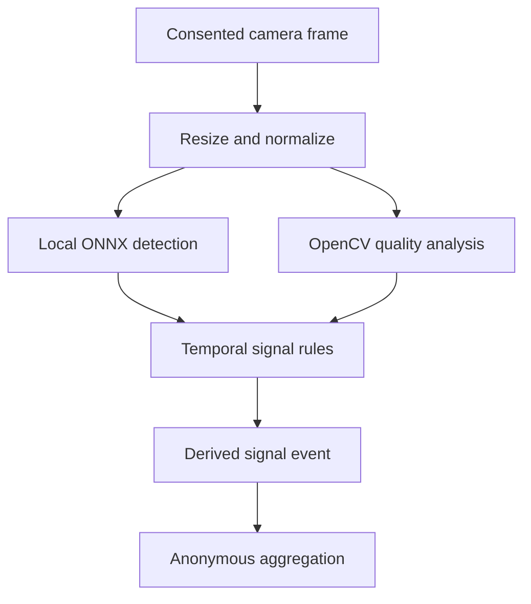

# Local Object Detection Architecture

**Status:** Proposed implementation plan\
**Owner:** ML and Backend teams\
**Last updated:** 2026-09-20

## Purpose

Define a privacy-first object-detection and visual-quality pipeline that can run on typical student and educator laptops without requiring a dedicated GPU.

The first release should detect observable lecture-delivery conditions. It must not identify people, infer emotions, diagnose behavior, or claim to measure attention or comprehension.

This document connects the local computer-vision pipeline to:

- [Professor Metrics and Dashboard Plan](../professor_metrics_dashboard.md)
- [AI Provider and Tool-Calling Implementation Plan](../ai_provider_tool_calling_plan.md)
- [Unified API Contracts](../api/unified_api_contracts.md)

## Scope

### MVP detections

The initial implementation should support:

1. `presenter_out_of_frame`: no presenter is detected inside the configured presentation region for a sustained period.
2. `board_or_screen_occluded`: the configured board or projected-screen region is substantially obstructed for a sustained period.
3. `slide_text_low_legibility`: the presentation region has measurable blur, low contrast, or text that is too small for the configured capture resolution.

These are delivery-quality signals. They are not student-attention signals.

### Explicitly out of scope

- Facial recognition or identity matching.
- Emotion, engagement, disability, or motivation inference.
- Individual student tracking.
- Gaze-based attention scoring.
- Biometric templates or face embeddings.
- Uploading raw frames by default.
- General-purpose recognition of every object in a classroom.
- Continuous recording of video for later analysis.

**TEAM DECISION: Approve the MVP detector list and confirm that facial recognition, identity matching, emotion inference, and individual student tracking remain prohibited.**

## Terminology

- **Object detection:** locating an allowed object class, such as `person`, in a frame.
- **Object recognition:** identifying a specific instance or person. The product does not require this behavior.
- **Visual-quality analysis:** measuring blur, contrast, occlusion, framing, or text legibility without identifying a person.
- **Detection:** a model output for one sampled frame.
- **Candidate issue:** a sequence of related detections that has not met the duration or confidence threshold.
- **Signal event:** a validated, sustained condition that may be stored as derived data.
- **Execution provider:** the CPU, GPU, or NPU backend used to run the same ONNX model.

## Recommended approach

Use one small object detector for presenter presence and OpenCV image-quality methods for blur, contrast, and region analysis. Do not run a large multimodal model on every frame.

Recommended first implementation:

- OpenCV for frame capture, resizing, color conversion, region analysis, and classical quality measurements.
- A quantized ONNX detector with an input size no larger than `320 x 320` for the `person` class.
- ONNX Runtime for inference with the CPU execution provider as the required baseline.
- Optional hardware execution providers only after the CPU version is correct and benchmarked.
- Temporal rules that require a condition to persist across multiple samples before emitting a signal event.
- An in-memory frame buffer with bounded size and no default frame persistence.

ONNX Runtime adds a dependency, but it provides one inference API across CPU and optional hardware accelerators. This is preferable to maintaining separate platform-specific model implementations.

**TEAM DECISION: Select the initial ONNX model only after reviewing its license, model size, supported operators, accuracy, and CPU benchmark results.**

**TEAM DECISION: Approve ONNX Runtime as the inference runtime or document why OpenCV DNN alone meets the cross-platform requirements.**

## Local processing flow



The frame must be released after local inference unless it remains inside the approved short-lived in-memory buffer. The professor dashboard and cloud AI providers receive only approved derived events and aggregates.

## Laptop compatibility target

It is not possible to guarantee useful real-time inference on literally every laptop. The product should define a minimum supported baseline, run a startup benchmark, and degrade gracefully on slower hardware.

### Minimum supported baseline

| Resource | Initial target |
| --- | --- |
| CPU | 64-bit x86 or ARM processor with at least 2 physical cores and 4 logical threads |
| System memory | 8 GB RAM |
| Dedicated GPU | Not required |
| Free storage | 1 GB for the application, runtime, model, cache, and logs |
| Camera input | 360p or higher local camera or approved virtual-camera source |
| Operating systems | Supported Windows x64, macOS Intel/Apple Silicon, and Linux x64 distributions used by the packaged application |
| Network | Not required for local inference after installation and model verification |

The minimum device should run one detector at `1-2` sampled frames per second using CPU inference. It does not need to process the camera's full frame rate.

### Recommended baseline

| Resource | Initial target |
| --- | --- |
| CPU | Modern 4-core processor |
| System memory | 16 GB RAM |
| Dedicated GPU or NPU | Optional |
| Camera input | `640 x 360` or `640 x 480` |
| Sampling rate | `3-5` analyzed frames per second |

### Performance budgets

These are product targets that must be validated through benchmarks rather than assumed hardware guarantees:

- Quantized model size: at most `30 MB`.
- Model input: at most `320 x 320` for the MVP.
- Vision worker additional memory: target at most `500 MB`.
- CPU inference latency on the minimum benchmark laptop: target p95 at most `500 ms` per sampled frame.
- CPU inference latency on the recommended benchmark laptop: target p95 at most `200 ms` per sampled frame.
- Cold model initialization: target at most `5 seconds`.
- Dropped or skipped frames must not block system-audio capture, transcription, or the Electron interface.
- The worker must stay within a configurable CPU budget by reducing the sampling rate before disabling the detector.

These targets favor sustained lecture-length operation over high frame rate. A signal that lasts several seconds does not require 30-FPS inference.

**TEAM DECISION: Select the oldest Windows, macOS, and Linux laptops used as the official minimum benchmark devices.**

**TEAM DECISION: Approve the memory, latency, initialization, CPU-use, and model-size budgets after measuring the first prototype.**

## Adaptive performance profiles

Run a short local benchmark during first-run setup or when the model changes. Select the highest profile that meets the device budget.

| Profile | Input | Sampling target | Behavior |
| --- | --- | --- | --- |
| `low_power` | `320 x 180` capture resized to model input | `1 FPS` | Presenter framing only; defer expensive quality checks |
| `balanced` | `640 x 360` capture resized to model input | `3 FPS` | All MVP detectors |
| `performance` | `640 x 480` capture resized to model input | `5 FPS` | All MVP detectors with faster temporal confirmation |
| `disabled` | None | `0 FPS` | Explain that local visual analysis is unavailable; continue non-visual features |

The application should dynamically lower the sampling rate when inference falls behind. It must not queue an unbounded number of frames.

The application must not silently switch from local inference to cloud inference when a device is slow.

**TEAM DECISION: Decide whether users can manually select a performance profile or only accept the benchmark recommendation.**

**TEAM DECISION: Define when the application pauses visual analysis on battery power or under sustained resource pressure.**

## Cross-platform inference

The CPU execution provider is the compatibility baseline. Optional acceleration may be enabled when packaged and validated for a platform:

| Platform | Baseline | Optional acceleration |
| --- | --- | --- |
| Windows x64 | ONNX Runtime CPU | WinML, DirectML, OpenVINO, or CUDA where supported |
| macOS Intel | ONNX Runtime CPU | CoreML where supported by the selected model/runtime package |
| macOS Apple Silicon | ONNX Runtime CPU | CoreML where supported by the selected model/runtime package |
| Linux x64 | ONNX Runtime CPU | OpenVINO or CUDA where supported |
| Linux ARM64 | Not part of the initial laptop support promise | Evaluate CPU or platform-specific execution providers later |

Execution-provider selection must always include the CPU provider as the final fallback. Provider-specific objects must not cross the local inference boundary.

Start with CPU-only packaging. Add accelerator packages only when they provide a measured improvement that justifies their installation size and platform complexity.

## Detection rules

### Presenter out of frame

1. Detect the allowed `person` class inside the configured presenter region.
2. Convert frame-level detections into a boolean candidate condition.
3. Require the condition to remain true for the configured duration.
4. Emit one event when the condition begins and close it when the presenter returns.
5. Apply a cooldown to avoid repeated events for one continuous issue.

The detector must not identify which person is present.

### Board or screen occluded

1. Let the educator configure or confirm the board/screen region.
2. Measure overlap between allowed foreground detections and the region.
3. Combine overlap with visibility or edge-change measurements.
4. Require sustained evidence before emitting an event.

Automatic board/screen discovery may be evaluated later. A user-confirmed region is more predictable for the MVP.

### Slide text low legibility

Use deterministic visual measurements before adding another model:

- Blur score.
- Local contrast.
- Estimated text size at the captured resolution.
- OCR confidence only if an approved local OCR component is already available.

Do not interpret low OCR confidence as proof that handwriting is objectively unreadable. Report it as a possible legibility issue with evidence.

**TEAM DECISION: Define confidence, duration, overlap, cooldown, blur, contrast, and text-size thresholds. The ML and Backend teams own these thresholds.**

**TEAM DECISION: Decide whether board and screen regions are manually configured, automatically detected, or both. Manual confirmation is recommended for the MVP.**

## Derived event contract

Frames and bounding boxes are local working data. The durable output is a typed derived event.

```json
{
  "event_id": "signal_evt_123",
  "session_id": "session_123",
  "signal_type": "presenter_out_of_frame",
  "start_ms": 842000,
  "end_ms": 860000,
  "confidence": 0.91,
  "detector_version": "presenter_frame_v1",
  "evidence": {
    "sample_count": 18,
    "positive_sample_count": 17,
    "performance_profile": "balanced"
  }
}
```

Do not include:

- Raw frames or frame URLs.
- Face crops or embeddings.
- Full bounding-box histories.
- Device identifiers.
- Student identifiers.
- Local filesystem paths.

The final schema must live in shared contracts and be reflected in Pydantic models, generated frontend types, OpenAPI or AsyncAPI as appropriate, and contract tests. This example is not the canonical API contract.

**TEAM DECISION: Approve the derived-event evidence fields and decide whether precise bounding boxes are ever retained locally. The privacy-first recommendation is not to retain them.**

## Suggested implementation structure

```text
backend/app/local_ml/
├── detector_models.py
├── frame_preprocessor.py
├── onnx_object_detector.py
├── presenter_frame_detector.py
├── visual_quality_analyzer.py
├── temporal_signal_rules.py
└── vision_capability_benchmark.py

backend/app/sessions/
├── signal_event_models.py
├── signal_event_service.py
└── signal_aggregation_service.py
```

Avoid generic modules such as `helpers.py` or `utils.py`. Each module should describe its domain responsibility.

Suggested provider-neutral interface:

```python
from typing import Protocol


class LocalVisionDetector(Protocol):
    """Run an approved vision model without persisting the input frame."""

    def detect_objects(
        self,
        frame: FrameBuffer,
        lecture_time_ms: int,
    ) -> list[ObjectDetection]:
        """Detect allowlisted object classes in one local frame.

        Args:
            frame: In-memory frame owned by the local vision worker.
            lecture_time_ms: Frame time relative to the lecture start.

        Returns:
            Validated detections using local-only coordinates.

        Raises:
            VisionModelUnavailableError: If the model cannot be loaded or run.
            InvalidFrameError: If the frame does not satisfy input constraints.
        """
```

Frame ownership must be explicit. The caller should release the frame after detection, and the detector must not log or persist it.

## Cloud-provider support

### Recommended default

Object detection remains local. Any cloud AI provider may receive approved derived signal events and aggregates through the tool-calling architecture, but it must not receive raw frames.

This allows OpenAI, Meta Muse, or another provider adapter to generate professor feedback without becoming the object detector.

### Portable self-hosted option

The same ONNX model and preprocessing code can be packaged in an Open Container Initiative-compatible container and deployed to a managed container service or Kubernetes environment on AWS, Google Cloud, Microsoft Azure, or another provider.

The portable container should:

- Expose one authenticated, versioned inference contract.
- Load the same approved model artifact by digest.
- Return the same provider-neutral detections.
- Avoid cloud-vendor SDK types in domain models.
- Disable request-body and image logging.
- Delete request buffers immediately after inference.
- Use regional deployment, encryption in transit, workload identity, rate limits, and audit metadata.

Cloud portability does not make cloud processing privacy-equivalent to local processing. Sending a frame to a remote container still sends media off the device.

### Cloud mode privacy gate

The current repository rules prohibit raw webcam frames from entering the application API. Therefore, remote frame inference must not be implemented until the team approves an architecture decision that explicitly changes or creates a narrowly scoped exception to that boundary.

If a future cloud mode is approved, it must require:

- Separate, explicit consent describing that frames leave the device.
- No silent fallback from local to cloud.
- A visible provider and region.
- A no-storage or strictly bounded retention policy.
- Institutional and legal review.
- A deletion and incident-response process.
- Synthetic-only default tests and opt-in sandbox integration tests.
- A dedicated API contract separate from the normal professor-summary API.

Using a vendor's general vision API is not recommended for the MVP because model behavior, labels, retention terms, and output schemas differ by provider. Hosting the team's own container is more portable and keeps detection behavior consistent.

**TEAM DECISION: Decide whether remote frame inference is prohibited, institution-only, or an explicit opt-in mode. The privacy-first recommendation is to keep it prohibited for the MVP.**

**TEAM DECISION: If remote inference is approved later, select the first deployment provider while preserving the portable container and provider-neutral contract.**

## Failure and fallback behavior

- If the model fails to load, continue the lecture without visual analysis.
- If inference falls behind, drop old frames and lower the sampling rate.
- If the camera disappears, close active candidates and report the capability as unavailable.
- If confidence is insufficient, do not emit a signal event.
- If evidence coverage is insufficient, suppress the professor-facing metric.
- Never substitute a cloud call merely because local inference failed.
- Never block system-audio capture, transcription, or the lecture interface.

## Model and dependency policy

Before accepting a model:

- Record its source, version, checksum, license, training-data documentation, input/output schema, and supported object classes.
- Scan the model artifact and pin it by digest.
- Verify that redistribution inside the packaged application is permitted.
- Benchmark the exact exported ONNX artifact, not only the training framework.
- Test false positives and false negatives across classroom lighting, skin tones, mobility aids, clothing, camera angles, and presentation styles.
- Reject any model requiring identity, emotion, or demographic inference.

Before adding a dependency:

- Explain why OpenCV, ONNX Runtime, the Python standard library, and existing repository code are insufficient.
- Prefer direct, testable project code for temporal rules and transformations.
- Do not implement custom cryptography, codecs, or hardware runtimes.

## Testing and evaluation

### Unit tests

- Frame resizing and normalization.
- Bounding-box conversion and clipping.
- Allowed-class filtering.
- Confidence, duration, and cooldown rules.
- Dropped-frame and missing-camera behavior.
- Frame-buffer release on success and failure.
- Serialization that rejects prohibited fields.

### Model tests

- Use synthetic images and consented, approved evaluation recordings.
- Do not commit real classroom recordings or student images.
- Maintain separate evaluation fixtures for framing, occlusion, blur, and contrast.
- Measure precision, recall, false-event rate per lecture hour, inference latency, memory, and CPU use.
- Evaluate each supported operating system and hardware tier.

### Integration tests

- Mock the detector for normal backend and frontend tests.
- Keep real-model tests local or in a protected workflow with approved synthetic fixtures.
- Never call a cloud vision service in the default test suite or CI.
- If cloud mode is approved later, keep live tests explicit, opt-in, and synthetic.

### Initial acceptance targets

These are evaluation targets, not guarantees:

- No raw frame persists after the approved in-memory lifetime.
- The minimum benchmark laptop sustains `low_power` mode for a full lecture.
- The recommended benchmark laptop sustains `balanced` mode for a full lecture.
- Visual analysis does not cause user-visible audio or interface interruptions.
- Every emitted event includes a detector version and sufficient evidence metadata.
- The false-event rate is low enough that educator reviewers consider the dashboard actionable rather than noisy.

**TEAM DECISION: Set detector-specific precision, recall, and false-event-rate acceptance thresholds after collecting an approved evaluation set.**

## Implementation phases

### Phase 1: Capability spike

- Evaluate two or three redistributable lightweight ONNX models.
- Implement CPU inference on Windows, macOS Intel/Apple Silicon, and Linux x64.
- Benchmark latency, memory, CPU use, and model initialization.
- Select minimum and recommended benchmark laptops.

### Phase 2: Presenter framing

- Implement local frame sampling and preprocessing.
- Add allowlisted person detection and temporal rules.
- Emit `presenter_out_of_frame` events locally.
- Add synthetic fixtures and privacy tests.

### Phase 3: Visual quality

- Add configured board/screen regions.
- Implement occlusion, blur, contrast, and text-size analysis.
- Validate findings with educator team members.

### Phase 4: Aggregation and dashboard

- Aggregate derived events into anonymous lecture intervals.
- Add the canonical shared contract and regenerate OpenAPI.
- Connect findings to professor-dashboard evidence and suggestions.

### Phase 5: Optional acceleration

- Evaluate platform execution providers.
- Add an accelerator only when it provides a measured benefit without breaking the CPU fallback.
- Keep model outputs identical across providers within documented tolerances.

### Phase 6: Optional cloud architecture review

- Create an ADR only if the team wants remote frame inference.
- Complete privacy, security, retention, and institutional review.
- Define the dedicated remote-inference contract and explicit consent flow.
- Deploy the same containerized model to one provider before testing portability elsewhere.

## Definition of done

- The model runs on the approved minimum CPU-only benchmark laptop without a dedicated GPU.
- Windows, macOS, and Linux packages use the same versioned ONNX model and normalized output schema.
- Slower devices automatically reduce sampling without blocking core lecture features.
- Raw frames are not written to disk, logs, normal APIs, professor reports, or AI-provider tool results.
- The detector never identifies people or infers emotion or attention.
- Derived events use lecture-relative millisecond timestamps and validated types.
- Every model and dependency has a recorded version, license, and checksum.
- Default tests use mocks or synthetic fixtures and make no cloud calls.
- The professor dashboard shows evidence, coverage, and uncertainty.
- Any future cloud mode requires a separate approved ADR and explicit consent.

## References

- [OpenCV Deep Neural Network module](https://docs.opencv.org/4.x/d6/d0f/group__dnn.html)
- [ONNX Runtime execution providers](https://onnxruntime.ai/docs/execution-providers/)
- [ONNX Runtime installation and compatibility](https://onnxruntime.ai/docs/install/)
- [AWS App Runner container-image services](https://docs.aws.amazon.com/apprunner/latest/dg/service-source-image.html)
- [Google Cloud Run container deployment](https://docs.cloud.google.com/run/docs/deploying)
- [Azure Container Apps containers](https://learn.microsoft.com/en-us/azure/container-apps/containers)
